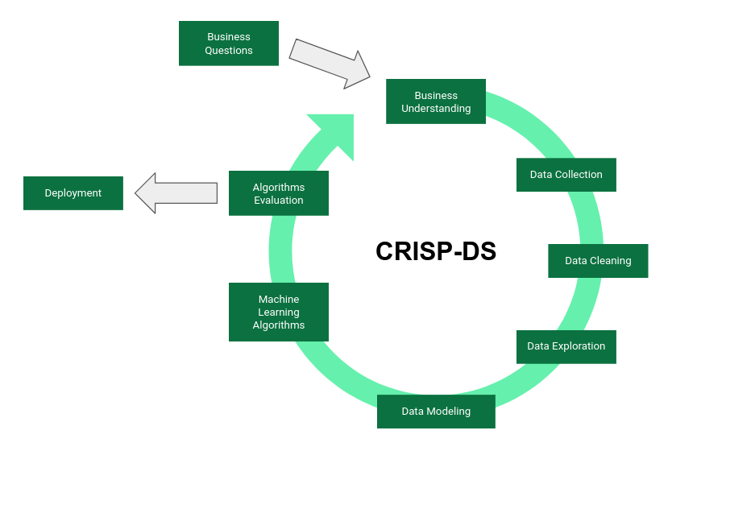

# Rossmann Sales Prediction

  

## Overview

This is a Sales Forecasting project in which we propose the sales prediction of a European pharmaceutical company, Dirk Rossmann GmbH. The data was collected via Kaggle from the [Rossmann Store Sales competition]([https://www.kaggle.com/competitions/rossmann-store-sales/overview](https://www.kaggle.com/competitions/rossmann-store-sales/overview)). According to the website [Statista](https://www.statista.com/statistics/1009587/rossmann-s-annual-revenue/) although Rossmann is a German company, it has a strong presence in Eastern Europe, where a good part of its profits originate. However, in its home country, Rossmann is not the market leader: its main competitor has a smaller number of stores, even though it makes more than a billion euros in profits. 

After an exploratory data analysis and the use of an algorithm called boruta to select the best features for a prediction using a XGBoost Regressor Machine Learning model, **we have achieved an average prediction of sales of €285,338,016.00 for the next six weeks** and implemented the solution in a way that is easily accessible for the company's business team.

## 1.0. Business Understanding

**What is the value of sales for each store over the next 6 weeks?** 

This company wants **to renovate its stores** and needs a sales projection to assist in determining the amount available for the investment.

## 2.0. Solution Planning

### 2.1. Business details:

- The forecast was requested by Rossmann's CFO, and the motivation behind the request is the difficulty in determining the investment amount for the renovations.
- Points to consider:
    - The difficulty is in determining the investment amount for renovations for each store, that is the reason for the predictions;
    - Our granularity was calculated on the store's per-day sales forecast for the next 42 days/6 weeks;
    - The problem is of the sales forecasting type, and we will follow a time series method.
    - The delivery format will be the total value of sales at the end of 6 weeks for each of the stores, which can be queried individually by the Telegram Messenger app.

### 2.2. Final product:

**A final “csv” spreadsheet** with a column containing the predictions and **a link to the Telegram Messenger** where it is possible to see the prediction for each of the stores.

### 2.3. Tools used:

- Python 3.9.13
- VS Code
- Jupyter Notebook
- Heroku: Cloud Application Platform
- Telegram Messenger

### 2.4. CRISP-DS:

We have based our workflow on a methodology known as CRISP-DM (**CR**oss-**I**ndustry **S**tandard **P**rocess - **D**ata **M**ining) that can be defined as follows:

“Put simply, CRISP-DM is a comprehensive data mining methodology and process model that provides anyone—from novices to data mining experts — with a complete blueprint for conducting a data mining project. CRISP-DM breaks down the life cycle of a data mining project into six phases: business understanding, data understanding, data preparation, modeling, evaluation, and deployment” (Hearer, 2000, p. 14).

This methodology was adapted to the reality of our project, and here its called CRISP-DS:

  

For this project we carried out **a single CRISP-DS cycle**, which, when presented to the business team, would be evaluated whether there was a need for a new cycle, to improve our metrics or not, if we already answered the business questions.

## 3.0. Assumptions

### 3.1. Features

- **Id** - an Id that represents a (Store, Date) duple within the test set
- **Store** - a unique Id for each store
- **Sales** - the turnover for any given day (this is what you are predicting)
- **Customers** - the number of customers on a given day
- **Open** - an indicator for whether the store was open: 0 = closed, 1 = open
- **StateHoliday** - indicates a state holiday. Normally
all stores, with few exceptions, are closed on state holidays. Note that all schools are closed on public holidays and weekends. a = public
holiday, b = Easter holiday, c = Christmas, 0 = None
- **SchoolHoliday** - indicates if the (Store, Date) was affected by the closure of public schools
- **StoreType** - differentiates between 4 different store models: a, b, c, d
- **Assortment** - describes an assortment level: a = basic, b = extra, c = extended
- **CompetitionDistance** - distance in meters to the nearest competitor store
- **CompetitionOpenSince[Month/Year]** - gives the approximate year and month of the time the nearest competitor was opened
- **Promo** - indicates whether a store is running a promo on that day
- **Promo2** - Promo2 is a continuing and consecutive promotion for some stores: 0 = store is not participating, 1 = store is participating
- **Promo2Since[Year/Week]** - describes the year and calendar week when the store started participating in Promo2
- **PromoInterval** - describes the consecutive intervals Promo2 is started, naming the months the promotion is started anew.
E.g. "Feb,May,Aug,Nov" means each round starts in February, May, August, November of any given year for that store

For the description of these features, we consulted the link below:

[https://www.kaggle.com/competitions/rossmann-store-sales/data](https://www.kaggle.com/competitions/rossmann-store-sales/data)

### 3.2. Fill NaN

1. Because Rossmann operates in Europe, we assume that its revenues are calculated in euros rather than american dollars.
2. We could have excluded the missing data, but much of this data represents temporal behaviors that we are interested in for our analysis. The features **competition_distance**, **competition_open_since_month**, **competition_open_since_year**, **promo2_since_week**, **promo2_since_year** and **promo_interval**, all presented missing data that we decided to fill in the missing data as follows:
    1. **competition_distance**: we assume that the missing data in this feature means that there is no competition in a meaningful range, so we fill the missing data with a default distance of 200 kilometers.
    2. **competition open since month** and **competition open since year**: we assume that there are simply no competitors in a significant area, or the nearest competitor simply does not negatively impact Rossmann's sales, so there is no need to record the opening month and year. We fill in the missing data with the date column
    3. **promo2_since_week**, **promo2_since_year** and **promo_interval**: we were very interested to know which months the promotions occurred, so we mapped the months and filled in the periods of the weeks and months with the promotions, because we assume it happened at the same period, however, when it was not possible to do this, we filled with zeros the missing data.

## 4.0. Development

The details of this project can be find in this [project notebook](./rossmann-sales.ipynb).

### 4.1. Data Collection

The data was collected from the Rossmann Store Sales competition on Kaggle, and can be found at the link below:

[https://www.kaggle.com/competitions/rossmann-store-sales/overview](https://www.kaggle.com/competitions/rossmann-store-sales/overview).

### 4.2. Hypotheses Testing

Of the 12 hypotheses tested, four were deemed highly relevant (although not all were validated true) and their elements were considered features for our machine learning model.

1. **H8. Stores should sell more over the years.**
- ***FALSE**** Stores sell less over the years.
1. **H9. Stores should sell more in the second half of the year.**
- ***FALSE**** Stores sell less in the second half of the year.
1. **H10. Stores should sell more after the 10th of every month.**
- ***TRUE**** Stores sell more after the 10th of each month.
1. **H11. Stores should sell less on weekends**
- ***TRUE**** Stores sell less on weekends

### 4.3. Data Preparation

We didn't need to **normalize** any of the data.
For **rescaling** we have applied MinMaxScaler to the features promo_time_week and year, and because of the outliers we have applied RobustScaler to competition_distance and competition_time_month.
For **encoding** we have applied One Hot Encoding for the state_holiday feature, Label Encoding for the store_type feature and Ordinal Encoding for the assortment feature.
For **transformation**, we have applied the logarithmic transformation to the sales feature, and Sin and Cosin transformation to the cyclical features: month, day, week_of_year and day_of_week.

### 4.4. Features Selection

Although we did a manual selection of features based on our exploratory data analysis, **we also employed the Boruta algorithm** to help us decide which features should be relevant for our Machine Learning model:

“In short, Boruta is based on the same idea which forms the foundation of the random forest classifier, namely, that by adding randomness to the system and collecting results from the ensemble of randomized samples one can reduce the misleading impact of random fluctuations and correlations. Here, this extra randomness shall provide us with a clearer view of which attributes are really important” (Kursa and Rudnicki, 2010, p. 3).

## 5.0. Algorithm Performance

We decided to train different machine learning models and use an Average Model as a baseline to test the accuracy of the models. After training, we applied a cross-validation test and looked at the root mean squared error (RMSE) of each model, we decided to start the first CRISP cycle with the model that had the highest RMSE, **XGBoost Regressor**, despite being the worst evaluated, because we could still improve this measure after hyperparameter fine tuning the model.

### 5.1.1. Single Performance

| Model Name | MAE | MAPE | RMSE |
| --- | --- | --- | --- |
| Random Forest Regressor | 722.70 | 0.11 | 1073.97 |
| Average Model | 1354.80 | 0.21 | 1835.14 |
| Linear Regression | 1867.09 | 0.29 | 2671.05 |
| Linear Regression - Lasso | 1891.70 | 0.29 | 2744.45 |
| XGBoost Regressor | 6683.71 | 0.95 | 7330.99 |

### 5.1.2. Real Performance - Cross Validation

| Model Name | MAE CV | MAPE CV | RMSE CV |
| --- | --- | --- | --- |
| LinearRegression | 2081.73+/-295.63 | 0.3+/-0.02 | 2952.52+/-468.37 |
| Lasso | 2116.38+/-341.5 | 0.29+/-0.01 | 3057.75+/-504.26 |
| Random Forest Regressor | 887.55+/-232.49 | 0.12+/-0.02 | 1328.39+/-340.35 |
| XGBoost Regressor | 7049.23+/-588.53 | 0.95+/-0.0 | 7715.24+/-689.3 |

### 5.2. Hperparameter fine tuning

Among the different possibilities for fine tuning the Machine Learning model, we selected **Random Search** because the tuning is fast and easy to implement. Compared to alternatives, such as Grid or Bayesian Search, this is a good alternative for the first CRISP cycle.

### 5.3. Final Model

| Model Name | MAE | MAPE | RMSE |
| --- | --- | --- | --- |
| XGBoost Regressor | 649.36 | 0.10 | 946.45 |

## 6.0. Financial Return

| predictions | €285,338,016.00 |
| --- | --- |
| worst_scenario | €284,610,153.28 |
| best_scenario | €286,065,876.78 |

## 7.0. Conclusion

The prediction for the next six weeks' sales of Rossmann's stores were made following the stages of the first cycle with a mean absolute error of 649.36, and a prediction of €285,338,016.00. With this mean absolute error (MAE), it is possible to extrapolate that our best and worst case scenarios are predicted to be €286,065,876.78 and €284,610,153.28 respectively.

The prediction of each store can be checked in the final "csv" spreadsheet with a column containing the predictions and a link to the Telegram Messenger where it is possible to simply write down the id number of any store and receive its prediction for the next six weeks.

1. [final_data.csv](./final_data.csv)
2. [https://t.me/rossmannpredbot](https://t.me/rossmannpredbot)

## 8.0. Next Steps

**This was only the first cycle of CRISP-DS, and each of its stages can be repeated in a new cycle to achieve a better result**. We may have a better understanding of the business, more data can be acquired, we can generate better insights through new hypotheses, new features can be considered, other machine learning models can be employed and compared in order to get better metrics: even though we achieved a good performance using XGBoost, this was only possible after the refinement of its hyperparameters, perhaps other models could bring better predictions with the same refinements. 

If the possibility of new cycles can bring benefits in terms of metrics that result in better predictions and financial return, they can be performed over and over, until the metrics are judged to be sufficiently adequate. Even the out-of-cycle stages can be improved: new business questions can be proposed or other forms of deployment can be considered.

### Bibliography and External Links:

Hearer, C. (2000). The CRISP-DM Model: the new blueprint for data mining.*Journal of Data Warehousing*, *5*(4), p. 13 - 22.

Kursa, MB., Rudnicki, WR. (2010). Feature Selection with the Boruta Package. *Journal of Statistical Software*, *36*(11), p. 1 - 13.

[https://www.kaggle.com/competitions/rossmann-store-sales/overview](https://www.kaggle.com/competitions/rossmann-store-sales/overview)

[https://www.statista.com/statistics/1009587/rossmann-s-annual-revenue/](https://www.statista.com/statistics/1009587/rossmann-s-annual-revenue/)

[https://www.kaggle.com/competitions/rossmann-store-sales/data](https://www.kaggle.com/competitions/rossmann-store-sales/data)
